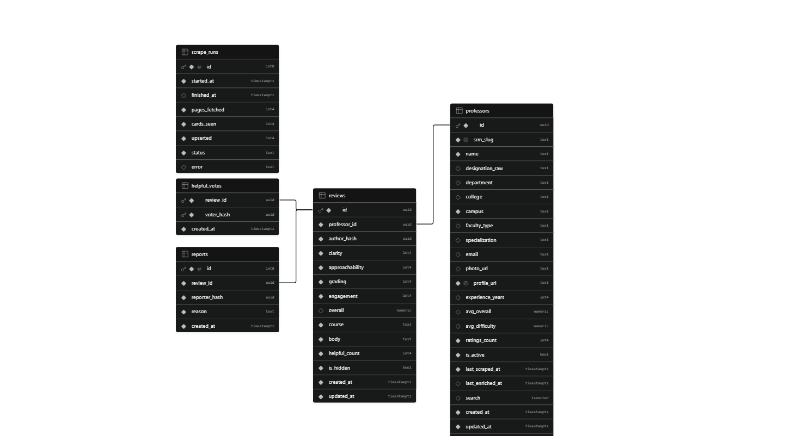

# ProfCheck

ProfCheck is a student-focused web platform for discovering professors, exploring structured student feedback, and sharing reviews anonymously.

## Architecture


| Layer          | Tool                                         |
| -------------- | -------------------------------------------- |
| Framework      | Next.js 16 App Router + React 19             |
| Styling        | Tailwind v4 + scoped CSS Modules             |
| UI primitives  | shadcn / Base UI                             |
| Database       | Supabase Postgres                            |
| Auth           | Supabase Auth                                |
| Email delivery | Resend                                       |
| Faculty data   | Scripts scraping the official SRMIST website |
| Hosting        | Vercel                                       |


### Frontend (`src/`)

Next.js 16 App Router + React 19. Styling is Tailwind v4 (theme tokens + utilities, no preflight) plus scoped CSS Modules per route and a small set of shadcn/Base UI primitives.


| Route               | What it does                                                                                  | Data                                                           |
| ------------------- | --------------------------------------------------------------------------------------------- | -------------------------------------------------------------- |
| `/`                 | Landing: hero search, live top-rated professor card, how-it-works, trust panel                | `getSpotlight()` (server)                                      |
| `/professors`       | Directory: instant search, department/campus filters, sort, grid/list, 50-per-page pagination | `getProfessors()` (server, ranged fetch), filtered client-side |
| `/professor/[slug]` | Profile: category averages, reviews with helpful votes, courses taught, related professors    | `getProfessor()`, `getReviews()`, `getRelated()` (server)      |
| `/login`            | Split-view OTP login: story panel + stepped email/code/success flow                           | Supabase Auth client                                           |


Shared pieces live in `src/components/site/` (header, dialogs, directory client, profile view, icon sprite). Auth session is refreshed by `src/middleware.ts`. Login state drives the header avatar menu and gates review submission.

Search is client-side token matching over the full directory: punctuation-normalized, every term must hit, name matches rank double, then alphabetical.

Professor photos load through `https://profcheck.tosh.cc.cd/srmimg?url=…` with an initials-tile fallback, because SRM blocks direct hotlinking.

### Backend (Supabase Postgres)


| Table           | Purpose                                                                                                                                                  |
| --------------- | -------------------------------------------------------------------------------------------------------------------------------------------------------- |
| `professors`    | 2,485 scraped rows: slug, name, department, college, campus, photo URL, specialization, `courses_taught[]`, rating aggregates, full-text `search` vector |
| `reviews`       | One row per student per professor: `clarity`, `approachability`, `grading`, `engagement` (1-5), generated `overall` (their average), course, body        |
| `helpful_votes` | One helpful vote per student per review, keeps `helpful_count` in sync                                                                                   |
| `reports`       | Abuse reports against reviews                                                                                                                            |
| `scrape_runs`   | Log of bulk scrape/enrichment runs                                                                                                                       |


Two Postgres triggers keep derived data correct: `refresh_professor_aggregates()` recomputes per-category averages, overall, and review counts (`SECURITY DEFINER` so it never depends on caller RLS context), and `refresh_helpful_count()` syncs vote totals.

Row Level Security: everyone can read professors and visible reviews (author identities are never exposed); only signed-in users can insert or edit their own reviews, votes, and reports.



Auth is Supabase email OTP restricted to `@srmist.edu.in`, with Resend as the SMTP provider and a branded OTP email template configured in the dashboard.

### Scraping

Faculty data was scraped using scripts from the official SRMIST website, then enriched and upserted into Supabase in batches.

A small cloudflare worker proxy serves the professor profile photos at `/srmimg?url={url}` to bypass hotlink protection.

## Setup

```bash
npm install
```

Copy `.env.example` to `.env.local` and fill in:

```
NEXT_PUBLIC_SUPABASE_URL=
NEXT_PUBLIC_SUPABASE_ANON_KEY=
NEXT_PUBLIC_SITE_URL=   # used for canonical URLs and OG metadata
```

```bash
npm run dev     # start dev server
npm run build   # production build
```

Database migrations live in Supabase and are applied in order: professors table, enrichment columns, reviews/votes/reports with triggers and RLS, aggregate hardening.